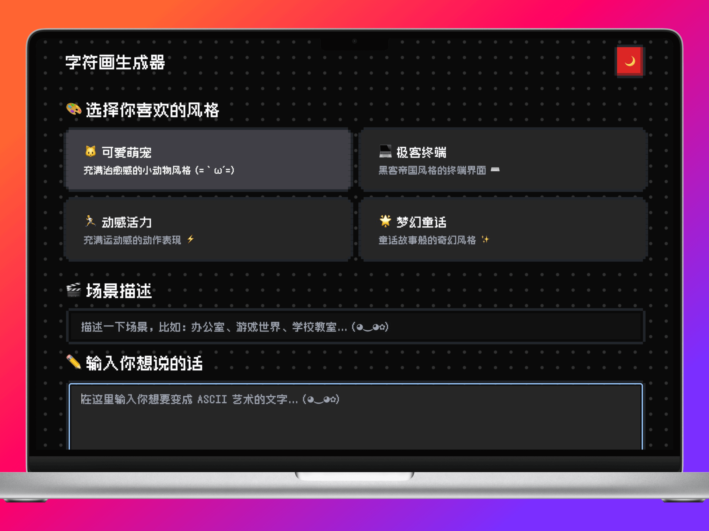

# AI-Driven ASCII Art Generator

[English](README.md) | [简体中文](README_zh.md)


## 🎨 Introduction

ASCII Art Generator is a modern web application that transforms your text into beautiful ASCII art. With four unique styles and AI-powered generation, it creates visually appealing text decorations perfect for social media, chat messages, or any text-based platform.

## 📸 Preview



🌈 **[Live Demo](https://nes-ascii-app.vercel.app)**

## 🛠️ Tech Stack

- ⚡ Nuxt 3
- 🎨 TailwindCSS
- 🎮 NES.css
- 🤖 OpenAI API
- 🌓 Color Mode
- 📦 pnpm@9.10.0

## ✨ Features

- **Multiple Artistic Styles**

  - 🐱 Cute Pets - Adorable animal-themed decorations
  - 💻 Geek Terminal - Matrix-style hacker aesthetics
  - 🏃 Dynamic Energy - Motion-inspired dynamic patterns
  - 🌟 Fairy Tale - Magical and dreamy decorations

- **Smart Generation**

  - AI-powered text transformation
  - Real-time streaming output
  - Precise character alignment
  - Context-aware scene adaptation

- **User Experience**
  - Intuitive interface
  - Mobile-friendly design
  - One-click copy function
  - Real-time preview

## 🚀 Quick Start

1. Clone the repository:

```bash
git clone https://github.com/hellokaton/ascii-art-generator.git
```

2. Install dependencies:

```bash
pnpm install
```

3. Set up environment variables:

```bash
cp .env.example .env
```

4. Start development server:

```bash
pnpm dev
```

## 📝 License

MIT License - see the [LICENSE](LICENSE) file for details

---

## 📮 Contact

If you have any questions or suggestions, feel free to:

- Open an Issue
- Twitter: [@hellokaton](https://x.com/hellokaton)
